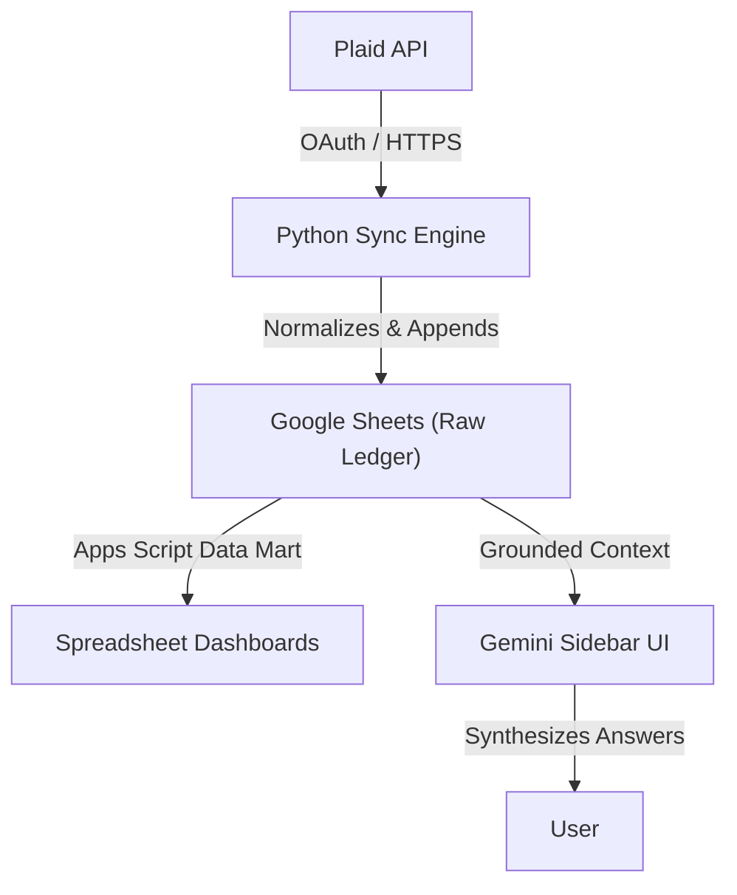

# Personal Finance Automation

Public documentation shell for a local-first financial intelligence engine.

The private repository syncs live transaction data from Plaid-linked institutions into Google Sheets, builds a spreadsheet-native data mart, and exposes a Gemini-powered sidebar that can answer finance questions using grounded local analytics.

This repository documents the architecture, the analytics model, the privacy boundary, and the demo-mode behavior without exposing implementation state, live Plaid tokens, or the user's private financial records.

## What This Demonstrates

- **Local-First Privacy**: A privacy model where Gemini receives only the specific spreadsheet data the Apps Script explicitly supplies.
- **Python Sync Engine**: A local Python backend that authenticates with Plaid and Google Sheets to extract, normalize, and append new transaction rows.
- **Google Apps Script & AI Orchestration**: A custom sidebar UI that builds analytics tables, renders embedded charts, runs Gemini chat orchestration, and dynamically falls back between deterministic local data and freeform Gemini synthesis.
- **Data Engineering**: Internal transfer exclusion, rolling weekly/monthly category aggregations, and robust error handling.

## Public Artifacts

- [Sample Data Fixtures](./examples/sample_data/): Synthetic CSV fixtures used for local "Demo Mode" dry-runs without hitting live banking APIs.
- [Sanitized Code Excerpts](./examples/sanitized-code-excerpts/): Safe excerpts of the Python Sync Engine (`src/engine`) and the Apps Script UI (`src/appscript`), proving the technical integration pattern while masking private deployment IDs.

## Related Public Proof Shells

This repository is the public-safe docs shell for a private local-first finance automation project. Private implementation repos, Plaid tokens, live financial records, spreadsheet IDs, Apps Script deployment IDs, and local runtime state are intentionally not linked publicly.

- [Portfolio project page](https://www.michaelspanico.com/projects/personal-finance-automation)
- [Portfolio Website Docs](https://github.com/mp2123/Portfolio-Website-Docs)
- [Michael Panico GitHub profile](https://github.com/mp2123)

## Architecture Overview

## Public vs. Private Boundary

This public repository includes:
- Architecture summaries and flowcharts.
- Synthetic `sample_data` fixtures to prove schema structure.
- Sanitized Apps Script `.gs` and `.html` files.

This public repository will not include:
- Plaid access tokens, client IDs, or `.env` files.
- Real bank transaction data.
- Live `GOOGLE_SPREADSHEET_ID` or `GOOGLE_APPS_SCRIPT_ID` variables.
- Mac-specific `.command` execution shortcuts or PyInstaller outputs.

## Status

This is a **Documentation Shell** for portfolio and professional review. The private system remains local/private; this public repo documents the architecture, demo-mode behavior, and privacy boundary without publishing live financial data or provider state.
